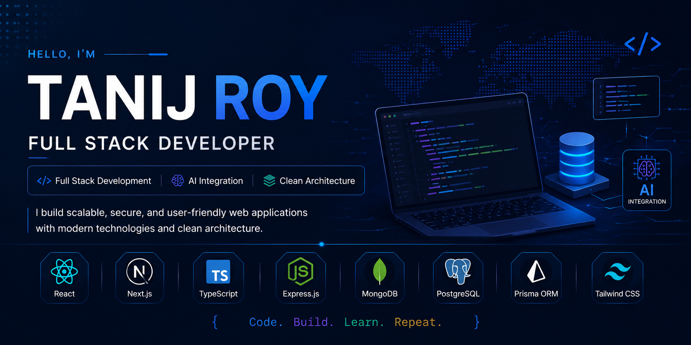

<!-- <h1 align="center">Tanij Roy</h1> -->
<h3 align="center">Full Stack Developer · JavaScript Ecosystem · AI-Integrated Systems</h3>

<p align="center">
  <a href="mailto:tanishroy480@gmail.com">
    
  </a>
  &nbsp;
  <a href="https://www.linkedin.com/in/tanijroy/" target="_blank">
    
  </a>
  &nbsp;
  <a href="https://web.facebook.com/tanij.roy" target="_blank">
    
  </a>
</p>

---

## About

I build full-stack web applications with a focus on clean architecture, scalable APIs, and practical AI integration. My work spans React frontends, Node.js/Express backends, and multi-database systems using both MongoDB and PostgreSQL.

Currently targeting **Junior Full Stack Developer** and **Junior Software Engineer** roles where I can contribute to production-grade systems from day one.

---

## What I'm Working On

- Extending **LoanLink** with additional AI-driven analytics and report automation
- Deepening expertise in **TypeScript** across both frontend and backend layers
- Exploring **Next.js** for full-stack applications with server-side rendering

---

## Featured Project

### LoanLink — Full-Stack Loan Management Platform

A production-ready loan management platform with role-based access control, real-time status tracking, and an AI-powered reporting microservice.

**Core Stack:** React · Node.js · Express.js · MongoDB · Firebase Authentication

**What it does:**
- Users browse available loans, submit applications online, and track approval status
- Admins and managers review applications, approve or reject requests, and manage users
- Role-based dashboards tailored to each user type

**AI Microservice — Built from Scratch**

The most technically complex part of the project is a dedicated AI microservice with its own architecture, data layer, and deployment.

```
React Frontend → Express/MongoDB API → AI Microservice → Gemini AI → PostgreSQL → PDF Output
```

| Layer | Technology |
|---|---|
| Language | TypeScript |
| ORM | Prisma |
| Database | PostgreSQL |
| AI Model | Gemini API |
| Output | PDF Report Generation |

**Capabilities:**
- Generates loan summaries, risk analysis, repayment projections, and recommendations
- Stores structured reports in PostgreSQL with metadata synced to MongoDB
- Produces downloadable PDF reports on demand
- Includes error handling with retry mechanisms
- Deployed independently on Render

---

## Technology Stack

**Languages**

<p>
  
</p>

**Frontend**

<p>
  
</p>

> Also using: **ShadCN UI**

**Backend**

<p>
  
</p>

> Also using: **Next.js API Routes · JWT Authentication · Firebase Authentication**

**Database & ORM**

<p>
  
</p>

**AI & APIs**

<p>
  
</p>

> Google Gemini API integration for AI-generated reports and analysis

**Tools & Platforms**

<p>
  
</p>

> Also using: **Trello · Chrome DevTools**

---

## GitHub Stats

<p align="center">
  
  &nbsp;
  
</p>

<p align="center">
  
</p>

---

## Contact

| Channel | Details |
|---|---|
| Email | [tanishroy480@gmail.com](mailto:tanishroy480@gmail.com) |
| LinkedIn | [linkedin.com/in/tanijroy](https://www.linkedin.com/in/tanijroy/) |
| Facebook | [facebook.com/tanij.roy](https://web.facebook.com/tanij.roy) |

---

<p align="center">
  
</p>


<!--
**TanijRoy1/TanijRoy1** is a ✨ _special_ ✨ repository because its `README.md` (this file) appears on your GitHub profile.

Here are some ideas to get you started:

- 🔭 I’m currently working on ...
- 🌱 I’m currently learning ...
- 👯 I’m looking to collaborate on ...
- 🤔 I’m looking for help with ...
- 💬 Ask me about ...
- 📫 How to reach me: ...
- 😄 Pronouns: ...
- ⚡ Fun fact: ...
-->
